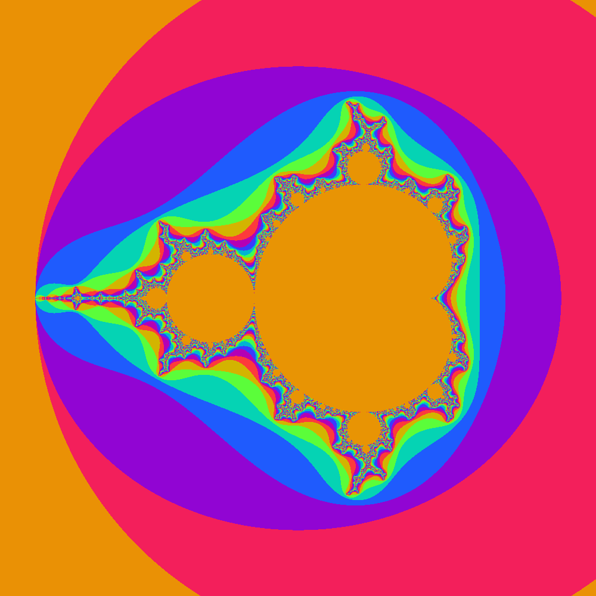

# Mandelbrot_OpenCL
Implementation of Mandelbrot Fractal in OpenCL.
<https://en.wikipedia.org/wiki/Mandelbrot_set>

Please Note:
This was a hobbyproject and will not be updated or maintained.

# Build 

Requires Boost and CMake to build.

```
 mkdir build
 cd build
 cmake ..
 make
 
```

# Usage 

./mandelbrot_opencl {Image widh} {Image height} {Maximum iterations}

# Example

./mandelbrot_opencl 1000 1000 1000



# Used Libaries 

<https://github.com/ddemidov/vexcl> <br />
Copyright (c) 2012-2018 Denis Demidov <dennis.demidov@gmail.com>

License file is located at third_party/vexcl/LICENSE.md
