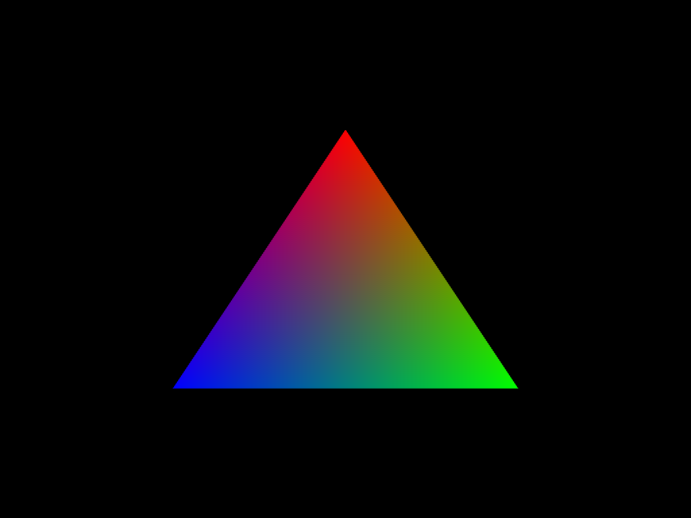

# Vulkan Hello World
Simple Hello World triangle in Vulkan 
<https://en.wikipedia.org/wiki/Mandelbrot_set>

Please Note:
This was a hobbyproject and will not be updated or maintained.

# Build 

Requires CMake and GLFW, Volk dependencies to build.

```
 mkdir build
 cd build
 cmake ..
 make
 
```

Compile the Shadercode.
```
glslangValidator -V shaders\shader.vert -o build\vert.spv
glslangValidator -V shaders\shader.frag -o build\frag.spv
```
